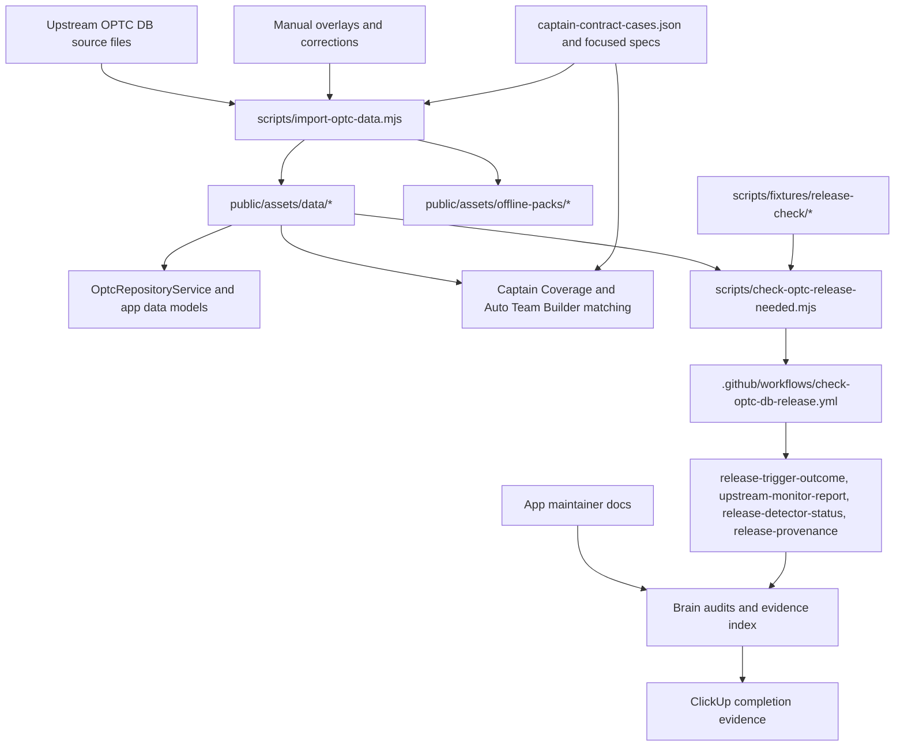

# Cross-Repo Architecture Map

Use this map when a change spans OPTC data import, generated assets, runtime
matching, release detection, and brain-side evidence. It shows where the app
repo owns executable behavior and where the sibling brain repo owns durable
audit context.

## System Map

## Ownership Layers

| Layer | App source of truth | Brain evidence |
| --- | --- | --- |
| Import and normalization | `scripts/import-optc-data.mjs`, `scripts/lib/optc-dataset.mjs`, `scripts/data/` | Task audits when import rules, corrections, or generated-data policy changes |
| Generated dataset | `public/assets/data/optc-manifest.json`, `optc-seed.sql`, `optc-preview.json`, `optc-auto-builder-abilities.json`, `optc-unresolved-images.json` | Evidence index entries for tasks that regenerate, validate, or explain dataset changes |
| Runtime consumers | `src/app/core/services/optc-repository.service.ts`, Captain Coverage services, Auto Team Builder services, Saved Enemy and picker flows | Audits that explain user-visible behavior, QA, and duplicate-prevention context |
| Captain contracts | `src/app/core/services/fixtures/captain-contract-cases.json`, `scripts/import-optc-data.spec.ts`, `scripts/lib/captain-ability-coverage.spec.ts`, runtime captain specs | Captain coverage audits and task notes when parser, generated tiers, or runtime matching drift |
| Release detection | `scripts/check-optc-release-needed.mjs`, `scripts/check-optc-upstream-monitor.mjs`, `scripts/release-detector-status.mjs`, `scripts/release-provenance-report.mjs`, `scripts/fixtures/release-check/`, `scripts/fixtures/release-provenance/` | `../../optc-team-builder-brain/OPTC_DB_AUTO_RELEASE_RUNBOOK.md` and release-trigger/provenance audits |
| Workflow and artifacts | `.github/workflows/check-optc-db-release.yml`, `.github/workflows/release-android.yml` | `../../optc-team-builder-brain/audits/evidence-index.md` plus task-scoped `live-artifacts/<task-id>/` summaries |

## Data Import To Runtime

The importer reads upstream data plus local corrections, applies centralized
normalization in `scripts/lib/optc-dataset.mjs`, and writes generated files under
`public/assets/data/`. The app runtime then loads the generated dataset through
repository services instead of re-parsing upstream source files in the browser.

Generated dataset changes should keep these surfaces aligned:

- [Data schemas](data-schemas.md) for persisted file shapes and schema policy.
- [Feature coverage map](feature-coverage-map.md) for owning areas and tests.
- [Maintainer validation guide](maintainer-validation-guide.md) for the smallest
  useful command set.

Use the manual-character and generated dataset validation rows when a change
touches importer logic, local overlays, generated `public/assets/data/*`, or
runtime assumptions about generated records.

## Captain Matching Contracts

Captain ability behavior is shared across parser output, generated coverage
tiers, and runtime matching. The contract matrix in
`src/app/core/services/fixtures/captain-contract-cases.json` keeps those layers
on the same representative cases.

The cheap gate is `npm run test:captain-contracts`. Add focused Angular specs
from the captain rows in the
[maintainer validation guide](maintainer-validation-guide.md) when runtime
services or UI behavior changes. If generated tiers change, the audit should
state whether the change is a parser fix, generated-data refresh, runtime
matching fix, or expected contract expansion.

## Release Detection And Status Artifacts

The release detector compares committed local dataset IDs with upstream OPTC DB
IDs. It should request a release only when upstream has character IDs missing
from the local `characters` table in `optc-seed.sql`.

Release detection uses these maintainer surfaces:

- `scripts/check-optc-release-needed.mjs` for the detector decision.
- `scripts/fixtures/release-check/` for replayable no-change, new-character,
  malformed, active-release, and upstream-drift scenarios.
- `.github/workflows/check-optc-db-release.yml` for scheduled and manual
  verification.
- `release-trigger-outcome`, `upstream-monitor-report`,
  `release-detector-status`, and `release-provenance` workflow artifacts for
  scan-friendly evidence.
- `../../optc-team-builder-brain/OPTC_DB_AUTO_RELEASE_RUNBOOK.md` for private
  operations context and incident replay notes.

Use `verify-only` for manual workflow checks unless the intent is to start a
production Android release when the detector finds releasable data.

## Brain Audits And Live Artifacts

The app repo should hold reusable public guidance and executable validation
routes. The brain repo should hold task-specific evidence that would be noisy,
private, or too contextual for public docs:

- tracked audits under `../../optc-team-builder-brain/audits/`
- the machine-readable evidence index at
  `../../optc-team-builder-brain/audits/evidence-index.json`
- ignored raw logs, screenshots, and command captures under
  `../../optc-team-builder-brain/live-artifacts/<task-id>/`
- ClickUp completion notes that preserve original task intent and prevent
  duplicate generated tasks for already-completed scope

Do not publish secrets, raw account data, bulky captures, or local command logs
in app docs. Summarize only the durable evidence path and the validation result.

## Update Expectations

When a PR changes import rules, generated dataset contracts, captain matching,
release detector decisions, workflow artifacts, or evidence routing, update this
map with the affected maintainer entry point. If the behavior is unchanged and
only an audit records task closeout, update the brain audit and evidence index
without inventing a parallel public workflow.
